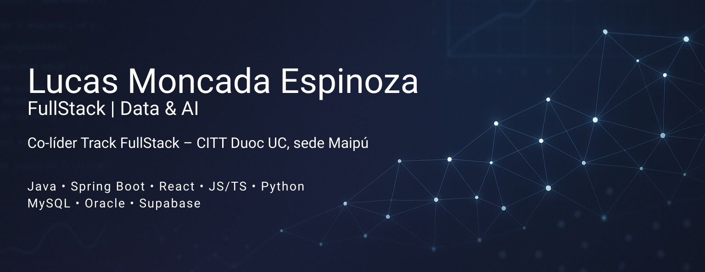

🎓 Estudiante de Ingeniería en Informática (DuocUC Maipú) | ⚙️ FullStack con enfoque Backend | 📊 Apasionado por Data Science & Arquitecturas Escalables

Soy estudiante de **4° semestre** y **co-líder del Track FullStack del CITT**. Me especializo en **backend, microservicios y diseño de sistemas**, con un fuerte interés en transformar problemas complejos en soluciones concretas y escalables.  
He participado en proyectos multidisciplinarios donde integro **Machine Learning, APIs modernas y arquitecturas cloud-native** para resolver desafíos reales.

---

## 🚀 Proyectos Destacados

### 🩺 **CardioSense – 1er Lugar Hackathon Duoc UC 2025 (Equipo 4)**
Sistema de **estimación de riesgo cardiometabólico** y **coaching personalizado**, combinando modelos de ML con LLMs (RAG + GPT-4o-mini).  
Incluye predicción de enfermedades, generación de recomendaciones personalizadas y paneles interactivos para profesionales.

**Stack Tecnológico:**
- **Frontend:** Next.js 15, React 19, TypeScript, Tailwind CSS  
- **Backend:** FastAPI (Python)  
- **Base de Datos:** Supabase (PostgreSQL + Auth)  
- **Machine Learning:** XGBoost, SHAP, scikit-learn  
- **LLM/IA:** GPT-4o-mini con RAG  
- **Deployment:** Cloudflare Pages + Hugging Face Spaces (Streamlit)

> Proyecto desarrollado para el Hackathon de Salud DuocUC 2025 usando datos NHANES. Arquitectura híbrida ML + LLM enfocada en impacto social y explicabilidad.

---

### 🕊️ **Descansos del Recuerdo SPA – Sistema Integral de Gestión de Urnas Funerarias**
Plataforma web completa para la gestión de productos, inventario, usuarios, pedidos y catálogo digital.

**Stack Tecnológico:**

#### 🌐 Frontend
- React 18  
- Vite  
- Bootstrap 5  
- Context API  
- Axios  
- React Router DOM  

#### ⚙️ Backend
- Spring Boot 3.5.6  
- Spring Security + JWT  
- Spring Data JPA (Hibernate)  
- MySQL 8  
- Maven  

#### 🧱 Arquitectura
- **Microservicios (5):** Ubicaciones, Catálogo, Inventario, Usuarios, Pedidos  
- Comunicación vía **APIs REST** con WebClient  
- Base de datos común: **gestion_urnas**

---

### 🔐 **API de Usuarios – Ecosistema Descansos del Recuerdo SPA**
API REST especializada en la gestión de usuarios, roles y direcciones, totalmente documentada y orientada a seguridad.

**Principales funciones:**
- Login y registro con **Spring Security + JWT**  
- CRUD completo de usuarios y direcciones  
- DTOs y validación con Jakarta  
- Documentación con **OpenAPI/Swagger**

**Stack:**  
Java 17 · Spring Boot 3.5.6 · JWT · MySQL · JPA/Hibernate · Maven · Lombok · Swagger UI  

> Proyecto que refuerza mi foco en backend, arquitectura limpia y seguridad.

---

### 🌱 **BloomWatch – NASA Space Apps / Sistema de Monitoreo de Floraciones Algales**
Plataforma que analiza **imágenes satelitales** (MODIS, Sentinel-2, SMAP, GPM) para detectar patrones de floraciones y generar predicciones.

**Backend (Python / FastAPI):**
- earthengine-api  
- pandas, numpy  
- scikit-learn  
- matplotlib, seaborn  

**Frontend (React):**
- React + Vite  
- axios  
- recharts  
- leaflet (mapas interactivos)

**Arquitectura:**  
Pipeline CLI + API REST + Dashboard web para análisis visual y predicciones.

---

## 🛠️ Tecnologías y Herramientas

### 🔹 Lenguajes de Programación

### 🔹 Frameworks y Librerías

### 🔹 Bases de Datos

### 🔹 Desarrollo Web

### 🔹 Otras Habilidades

---

## 📊 Estadísticas de GitHub

  

  
  
  

---

## 🌍 Redes Sociales & Contacto

  
  

---
