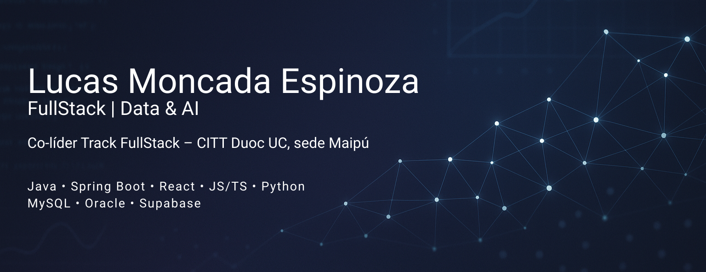

<h1 align="center">Hola, soy Lucas Moncada 👋</h1>

  <strong>AI & Data Software Engineer</strong> · Ingeniería en Informática · Ciencia de Datos

  <a href="https://www.linkedin.com/in/lucasmoncadae">LinkedIn</a> ·
  <a href="mailto:lucasmoncada017@gmail.com">Correo</a>

## Sobre mí

Desarrollo productos de **inteligencia artificial**, pipelines de datos y servicios backend. Tengo experiencia profesional construyendo soluciones con **Python, SQL, FastAPI, LangGraph y PostgreSQL**, integrando Machine Learning, sistemas multiagente, RAG y automatización de procesos.

Estudio **Ingeniería en Informática con mención en Ciencia de Datos** en Duoc UC y participo como **sublíder del track Full Stack & IA del CITT**.

- 🧠 **AI Engineering:** agentes, RAG, workflows con LLMs y evaluación de resultados.
- 📊 **Data & Machine Learning:** análisis, ETL, clustering, Deep Learning y visualización.
- ⚙️ **Software Engineering:** APIs, servicios backend, bases de datos y despliegues cloud.

## Experiencia reciente

- **AI & Data Software Engineer — Tremen SpA:** pipelines de tendencias, clustering semántico con K-Means y DBSCAN, pgvector, LangGraph, LangChain y FastAPI.
- **Practicante en Machine Learning — CENIA:** sistemas multiagente, búsqueda web paralela, pipelines ETL, analítica y automatización de reportes.

## Proyectos destacados

### 🩺 [CardioSense — 1.er lugar Hackathon de IA Aplicada](https://github.com/LucasMoncadaCL/hackaton_duoc_2025_Equipo4)

Asistente preventivo para estimar riesgos cardiovasculares y generar planes personalizados mediante **Machine Learning, RAG y modelos de lenguaje**. Desarrollado en 27 horas en una competencia con más de 100 estudiantes de Duoc UC y la PUC.

**Tecnologías:** Python · FastAPI · scikit-learn · RAG · PostgreSQL · React

### 🧠 [Deep Learning aplicado a Fashion-MNIST](https://github.com/LucasMoncadaCL/ep1-deep-learning-fashion-mnist)

Infraestructura reproducible para entrenar y evaluar MLPs con **TensorFlow/Keras**. Incluye experimentación controlada de learning rate, batch size y capacidad, registro de métricas, pruebas automatizadas y documentación técnica. Una configuración equilibrada alcanzó **89,33 % de accuracy y 0,8936 de F1 macro en validación**.

**Tecnologías:** Python · TensorFlow · Keras · scikit-learn · Pandas · Jupyter

### 🎵 [Spotify Popularity Analysis](https://github.com/LucasMoncadaCL/spotify-popularity-analysis)

Análisis reproducible de popularidad musical sobre Spotify Tracks, con exploración, validación de datos y comunicación de resultados.

**Tecnologías:** Python · Pandas · NumPy · Matplotlib · Seaborn · Jupyter

### 🌱 [BloomWatch — NASA Space Apps](https://github.com/LucasMoncadaCL/BloomWatchNasa)

Plataforma para analizar imágenes y datos satelitales, detectar patrones de floraciones algales y generar visualizaciones y predicciones.

**Tecnologías:** Python · FastAPI · scikit-learn · Pandas · React

## Tecnologías

| Área | Tecnologías |
|---|---|
| **Datos y ML** | Python, SQL, Pandas, NumPy, SciPy, scikit-learn, TensorFlow, Keras |
| **IA generativa** | LangGraph, LangChain, RAG, OpenAI API |
| **Backend y datos** | FastAPI, Java, Spring Boot, PostgreSQL, pgvector, MySQL, Redis |
| **Cloud y desarrollo** | Docker, Google Cloud, AWS, Git, GitHub, React, TypeScript |

## Certificaciones

- [Artificial Intelligence Expert Certificate (CAIEC)](https://www.credly.com/badges/723d8d12-f06d-460e-b6b7-a85343b5cc37/linked_in_profile) — CertiProf
- [Generative AI Professional Certification (GAIPC)](https://www.credly.com/badges/9f409184-7127-4ae4-9d96-2685bc6a1d3d/linked_in_profile) — CertiProf
- [Artificial Intelligence Professional Certification (CAIPC)](https://www.credly.com/badges/1e42fdef-f971-4850-9b07-27fd6865cfad/linked_in_profile) — CertiProf
- [Desarrollador FullStack](https://certificadovalida.duoc.cl/ValidacionQr?id=2839559683) — Duoc UC

## Actividad en GitHub

  

  
  

