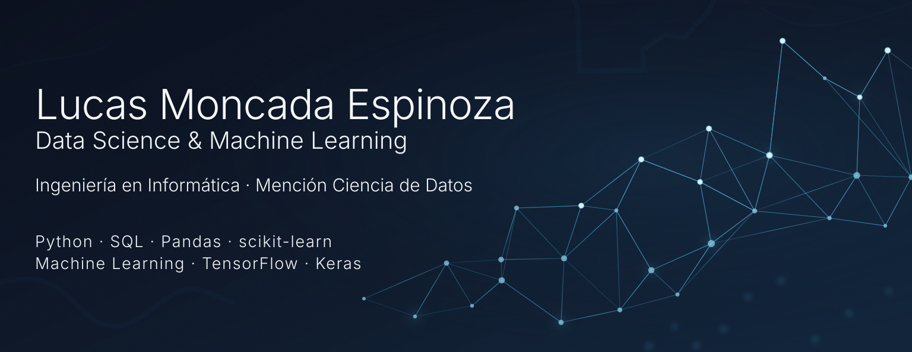

<h1 align="center">Hola, soy Lucas Moncada 👋</h1>

  <strong>Data Science & Machine Learning</strong> · Python · SQL · Estadística

  <a href="https://www.linkedin.com/in/lucasmoncadae">LinkedIn</a> ·
  <a href="mailto:lucasmoncada017@gmail.com">Correo</a>

## Sobre mí

Estudiante de **Ingeniería en Informática con mención en Ciencia de Datos**, con experiencia profesional y académica en preparación y calidad de datos, análisis estadístico, feature engineering, detección de anomalías, Machine Learning y construcción de pipelines reproducibles.

Trabajo principalmente con **Python, SQL/PostgreSQL, Pandas, NumPy, SciPy y scikit-learn**. Mi interés es desarrollar soluciones de Ciencia de Datos que combinen rigor analítico, evaluación reproducible e integración con sistemas utilizables.

## Experiencia reciente

### AI & Data Software Engineer — Tremen SpA

- Implementé componentes de un motor batch de detección de anomalías multivariantes mediante features temporales, covarianza regularizada, distancia de Mahalanobis y calibración empírica de scores.
- Trabajé con embeddings y clustering HDBSCAN, evaluando alternativas mediante ARI, pairwise F1, cobertura, ruido, estabilidad y false merges.
- Desarrollé componentes de pipelines de ingesta, normalización, calidad y trazabilidad de datos con Python, PostgreSQL/pgvector, Redis y almacenamiento compatible con S3.

### Practicante en Machine Learning — CENIA

- Diseñé una prueba de concepto multiagente para generar briefs comerciales.
- Implementé búsqueda web paralela, reportes estructurados y un pipeline ETL con Pandas para procesar inversión publicitaria y generar métricas por canal, franja horaria y programa.

## Proyectos seleccionados

### 🩺 [CardioSense — 1.er lugar en Hackathon de IA Aplicada](https://github.com/LucasMoncadaCL/hackaton_duoc_2025_Equipo4)

Proyecto de equipo orientado a la prevención cardiovascular mediante Machine Learning, recuperación de información y modelos de lenguaje. Desarrollado durante una hackathon de 27 horas con participación de más de 100 estudiantes de Duoc UC y la Pontificia Universidad Católica de Chile.

### 🧠 [Deep Learning aplicado a Fashion-MNIST](https://github.com/LucasMoncadaCL/ep1-deep-learning-fashion-mnist)

Proyecto colaborativo de experimentación reproducible con redes neuronales MLP en TensorFlow/Keras. Mi contribución se concentró en la infraestructura experimental y la configuración de hiperparámetros. La evaluación final alcanzó **89,33 % de accuracy y 0,8936 de F1 macro**.

### 🎵 [Spotify Popularity Analysis](https://github.com/LucasMoncadaCL/spotify-popularity-analysis)

Primera etapa de un proyecto académico de análisis reproducible sobre Spotify Tracks. Incluye contratos y validación de datos, análisis exploratorio, correlaciones, tamaño de efecto, detección de valores atípicos y discusión de sesgos. La etapa actual no incluye todavía entrenamiento de modelos.

## Tecnologías

- **Data Science:** Python, Pandas, NumPy, SciPy y scikit-learn
- **Estadística y Machine Learning:** análisis descriptivo, correlación y covarianza, detección de anomalías, clustering y evaluación de modelos
- **Deep Learning:** TensorFlow, Keras y redes neuronales MLP
- **Data Engineering:** SQL, PostgreSQL, ETL, calidad de datos, pgvector y Redis
- **Visualización:** Matplotlib y Seaborn
- **IA generativa:** LangGraph, LangChain, RAG y OpenAI API
- **Herramientas:** Git, GitHub, GitFlow, Docker, Jupyter y FastAPI
- **Conocimientos adicionales:** AWS y Google Cloud

## Formación

**Ingeniería en Informática — Mención Ciencia de Datos**  
Duoc UC, sede Maipú · 2024–2027, fecha estimada.

## Certificaciones

- [Artificial Intelligence Expert Certificate (CAIEC)](https://www.credly.com/badges/723d8d12-f06d-460e-b6b7-a85343b5cc37/linked_in_profile) — CertiProf
- [Generative AI Professional Certification (GAIPC)](https://www.credly.com/badges/9f409184-7127-4ae4-9d96-2685bc6a1d3d/linked_in_profile) — CertiProf
- [Artificial Intelligence Professional Certification (CAIPC)](https://www.credly.com/badges/1e42fdef-f971-4850-9b07-27fd6865cfad/linked_in_profile) — CertiProf

## Actividad en GitHub

  

  
  
  

### Actividad reciente en proyectos destacados

  
  
  

